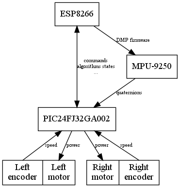

# SelfBalancing Robot (Yes, another self balancing robot...)

Self balanced robot that exposes a REST API to control it.

The Web is plenty of self balancing robots, vehicles with two wheels perpendiculars to the direction of movement that keep the equilibrium. This is just another one with WiFi connection.

## Features
- The robot keeps balanced :)
- REST API for: (documented [here](firmware/esp8266/doc/restapi.md))
  - Setting control algorithms parameters.
  - Getting runtime control data.
  - Setting speed and heading.

## Respository contents
- [`client/android`](client/android): Simple Android application to control robot movements via the REST API.
- [`client/htlm`](client/html): Single page Web application that renders runtime PID algorithm data. It also allows for getting and setting robot control parameters.
- [`client/testserver`](client/testserver): Robot REST API emulator for client development purposes.
- [`firmware/esp8266`](firmware/esp8266): Firmware source for ESP8266 controller.
- [`firmware/pic`](firmware/pic): Firmware source for PIC24FJ32GA002 controller.
- [`schematics`](schematics): Electronics schematics for [KiCad](http://kicad-pcb.org) suite.

## How it works
The robot [chassis](doc/chassis.md) consists of a platform with two DC motors and its wheels that form an [inverted pendulum](https://en.wikipedia.org/wiki/Inverted_pendulum). A circuit board monitors the inclination of the robot (pitch) and drives motors to keep the robot in balance.

The circuit has three main components:
- **[MPU-9250](https://www.invensense.com/wp-content/uploads/2015/02/PS-MPU-9250A-01-v1.1.pdf)**: It is a single chip that contains a 3-axis gyroscope, a 3-axis accelerometer and a compass. It runs a fusion algorithm for gyroscope and accelerometer outputs called Digital Motion 
Processor (DMP) that frees the PIC microcontroller of doing this work (compass is not used in this project). DMP outputs [quaternions](https://en.wikipedia.org/wiki/Quaternion) that are converted to pitch angles by PIC24FJ32GA002. MPU-9250 is assembled on a breakout board.

- **[PIC24FJ32GA002](https://www.microchip.com/wwwproducts/en/PIC24FJ32GA002)**: It is a 16-bit microcontroller that:
  - Calculates current pitch from MPU-9250 quaternions output.
  - Gets current speed and calculates heading based on motors encoders output.
  - Implements control algorithms for balancing, speed and heading.
  - Sets motors power.

- **[ESP8266](https://en.wikipedia.org/wiki/ESP8266)**: It is a cheap 32-bit microcontroller with WiFi connection that is assembled on a ESP12F breakout board. In this project, ESP8266:
  - Serves a REST API that enables clients to communicate with the robot.
  - Resolves REST API requests communicating with PIC24FJ32GA002 via I2C.
  - Initializes MPU-9250 module to save program memory space in the PIC24FJ32GA002. The MPU-9250 initialization requires loading the compiled DMP  firmware each time it is powered up. Therefore, this firmware should be stored in the PIC program memory reducing its capacity by 20%. In ESP8266 this is not a problem because ESP12F has 4MB of flash.

## Software Build
Build instructions for the two firmware code and REST client examples can be found in its own directory.

## Acknowledges
- To hobbits that share their projects and knowledge in GitHub, StackOverflow, StackExchange, Wikipedia, electronics forums...
- To previous hosts that permit people to share their knowledge.
