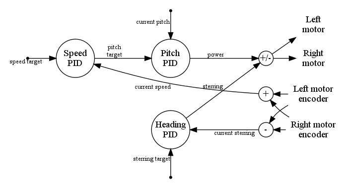
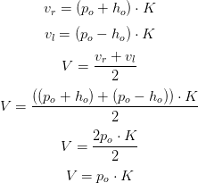

# SelfBalancing Robot: PIC24FJ32GA002
This directory contains the firmware code for the PIC24FJ32GA002 microcontroller. The code has been written for the [XC16 compiler](http://www.microchip.com/mplab/compilers) version 1.33.

PIC24FJ32GA002 interacts directly with MPU, motors and encoders.

## PIC24FJ32GA002 revision
The A3/A4 revision of PIC24FJ32GA002 does not work in this project. I know this because I had to suffer the bugs present in the I2C hardware of that revision (see [PIC24FJ64GA004 Family Silicon Errata and Data Sheet Clarification](http://ww1.microchip.com/downloads/en/DeviceDoc/80000470j.pdf) document). Finally, I used a B8 revision with no problems.

## Firmware description
The main PIC24FJ32GA002 responsibility is to manage the power of motors to keep the robot balanced with the desired speed and direction. It also supplies traced data from control algorithms to the ESP8266.

The code avoids float arithmetic and division operations to get better performance. In addition, the C preprocessor performs some calculations at compile time ([boost preprocessor](http://www.boost.org/doc/libs/1_66_0/libs/preprocessor/doc/index.html) library is used to help).

### Control system
PIC24FJ32GA002 get external inputs from MPU (robot pitch), ESP8266 (speed and heading targets) and encoders (wheels speed). Its outputs command each motor with:
- A PWM signal that controls the power supplied to the motor.
- Two complementary signals that control the rotatory direction.

The outputs are calculated with three [PID](https://en.wikipedia.org/wiki/PID_controller) controllers:
- Pitch controller to keep robot balanced.
- Speed controller to move the robot at desired speed.
- Heading controller to move the robot in the desired direction.



Speed and pitch controllers work in cascade. The output of speed controller is the pitch target that is the input of pitch controller. This configuration corrects possible deviations of center of gravity from the wheels axis. A small deviation in the center of gravity causes the equilibrium angle different from zero. If we set target speed to zero, speed controller will _magically_ calculate the actual balancing angle.

Pitch controller corrects any pitch deviation from the target set by speed controller by changing the linear speed of the robot. The linear speed of the robot depends entirely on the pitch controller and heading controller has no effect on it although the power supplied to each motor is a combination of outputs from pitch and heading controllers.

<p align="center">
	
</p>

where:
-  is the linear speed of the robot.
-  is the right wheel speed.
-  is the left wheel speed.
-  is a conversion constant factor that depends on the electrical characteristics of motors, radius of wheels,...   
-  is the pitch controller output.
-  is the heading controller output.

So, pitch controller controls the linear speed of the robot and heading controller controls its direction (angular speed).

### PID controller
PID implementation stores data produced in each iteration that can be obtained with the I2C protocol. This information can be used as a guide to adjust PID constants.

### Peripherals drivers
The source code for peripherals was generated with [MPLAB Code Configurator (MCC)](http://www.microchip.com/mplab/mplab-code-configurator) but the I2C master driver code (`i2c2.c` file) has been modified to correct what I think is a bug. 

#### I2C master patch
When `I2C2_Stop` was called, driver went to `S_MASTER_IDLE` state and a new I2C package could be sent before the stop signal on the I2C bus was completed. That is, the PIC could try to generate a start signal on the I2C bus when the stop signal has not yet been completed (when this happens, PIC believes that it is a bus collision). To correct this bug, a new driver state (`S_MASTER_STOP`) has been created. This state is set in the `I2C2_Stop` function and processed in the I2C interrupt function when hardware completes the stop signal. When this happens, driver pass to `S_MASTER_IDLE` state (it is ready to send new packages).

## Build
Build script is a simple Makefile (note: the Makefile produced by MPLAB does not work in the Cygwin environment).

Build process has been tested on a Windows OS with the [Cygwin](https://www.cygwin.com/) environment.

### Dependencies
This software must be installed:
- Make (in Cygwin environment).
- XC16 compiler.

MPLAB is not needed to build final firmware binary. MCC generated code are commited in the repository so you do not need to regenerate it.

### Generate firmware
```
> make
```

## Upload firmware
[PCB](../schematics/pcb_top.pdf) incorporates a [Microchip In-Circuit Serial Programming connector (ICSP)](http://ww1.microchip.com/downloads/en/DeviceDoc/31028a.pdf) for flashing the PIC24FJ32GA002. 

### Flash from command line
Makefile includes a target to load the firmware that assumes that a [PICkit 3](http://www.microchip.com/PICkit3) programmer is connected between your PC and the PIC. If this is the case, you can execute:
```
> make flash
```

If you have another programmer or you wish to use your own tools, you must load the `selfbalancing.hex` file generated in the `build` directory.

## Development IDE
[MPLAB-X](http://www.microchip.com/mplab/mplab-x-ide) has been the IDE used for the development process. `mpl` directory includes project files for MPLAB-X.
